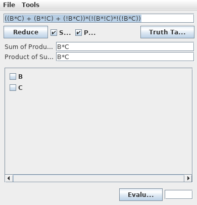

# Turaco

Lightweight boolean expression reducer, originally called [BExpred](https://sourceforge.net/projects/bexpred/).

Written by: Benjamin Biron
Modified by: Mitchell Hentges mitchhentges@protonmail.com

## Instructions

1) To run it:
	a) Unzip / untar the downloaded file
	b) In a console / command prompt, go to the "jar" directory
	c) From there: java -jar BExpred.jar
	NOTE: You'll need to have the java runtime in your PATH, for windows
	users, it's somewhere in the System icon from the control panel (May be
	called "Environment Variables"). For linux users running bash, it's
	likely in your ~/.bash_profile file.
	
2) Entering an expression:
	A valid boolean expression must be entered ex: A+B, A*B+C Var1+Var2^Var3
	The variable names may consist of anything except spaces and operator
	chars (+, *, !, etc).

	Operators and corresponding chars:
		AND	* or &
		OR	+ or |
		XOR	^
		NOT	! or ~

	You MUST specify an operator between 2 variables:
		A*B is NOT the same as AB

	If no operator is found before an opening bracket or after a closing
	one, an AND is asumed:
		(A+B)(C+A) is the same as (A+B)*(C+A)

3) Reducing the expression:
	The expression will be reduced if you press ENTER in the expression
	field or click the "Reduce" button. The SoP and PoS checkboxes specify
	whether you want the expression to be reduced as "Sum of Products" or
	"Product of Sums" or both.
	
	Expression with a large number of variables may take time to reduce and
	this is why you have the option to limit the reduction process by
	selecting only one form.

4) Evaluating an expression with given values:
	You may want to only evaluate an expression with certain values. This is
	achieved by typing in the expression, pressing enter, checking the
	variables you want as "1" and finally clicking the "Evaluate" button.

5) Other tools:
	There are other handy tools provided with BExpred:
	a) Truth table:
		Shows the truth table corresponding to the expression currently
		typed in the expression field.
		
	b) Expression comparator:
		Allows you to compare 2 expressions for equality

## Notes

The expressions are reduced via the Quine and Mc.Cluskey method. You can select
whether to output the reduced expression in the "Sum of Products (SoP)" form, the
"Product of Sums (PoS)" or both.

In some cases, they're may be more than 1 equivalently reduced valid expression,
eventually, I'll make sure to display all possibilities, but for now, only one
is displayed.

A minor code cleanup and commenting session is due, I'll try to make the time
for it soon.

## License

Released under the GNU GPL, see LICENSE.txt for details.
